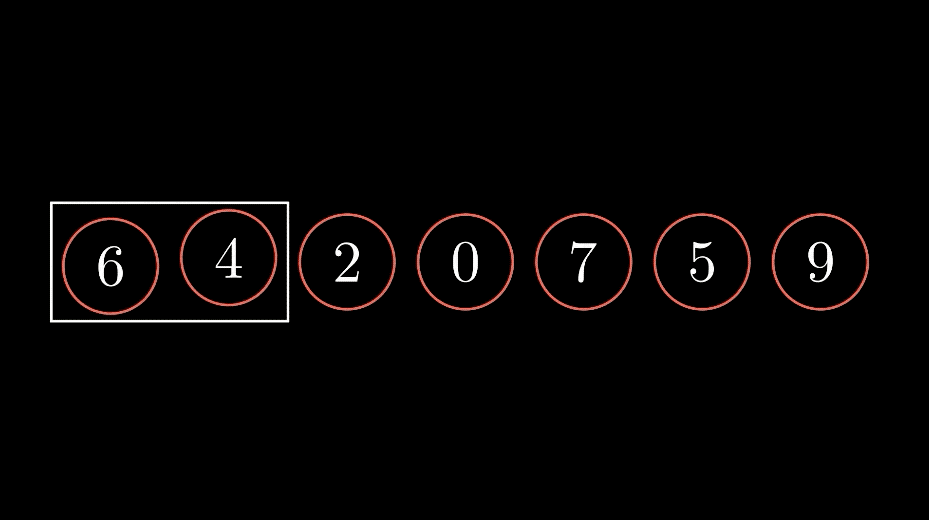

# bubble-sort

> The aim of this project is to implement the bubble sort algorithm. Assignment is focused on the use of yield and passing a block to a method

## Project specifications
> Create a method called #bubble_sort_by which sorts an array by accepting a block. Remember to use yield inside your method definition to accomplish this. The block will have two arguments that represent the two elements of the array that are currently being compared. The block’s return will be similar to the spaceship operator you learned about before: If the result of the block execution is negative, the element on the left is “smaller” than the element on the right. 0 means both elements are equal. A positive result means the left element is greater. Use the block’s return value to sort your array. Test your method with the example below.   
 ``> bubble_sort_by(["hi","hello","hey"]) do |left,right|  ``      
  ``> left.length - right.length``   
  `` > end  ``  
 `` => ["hi", "hey", "hello"] 
  ``
      
### 🎬 Demonstration

## 🔨 Built in

- Ruby
- Rubocop
- Stickler-CI

## 🚀 Our Project

Our project can be found at https://repl.it/@zerradi/bubblesort#main.rb
## Live Demo

[Live Demo Link](https://repl.it/@zerradi/bubblesort#main.rb)

## 👨🏽‍💻 👨🏿‍💻 Creators

👤 **Author1**

- Github: [@dasileker](https://github.com/dasileker)

👤 **Author2**

- Github: [@ggotora](https://github.com/ggotora)

## 🤝 Contributing

Contributions, issues and feature requests are welcome!

Feel free to check the [issues page](issues/).

## Show your support

Give a ⭐️ if you like this project!

## 📝 License

This project is [MIT](lic.url) licensed.